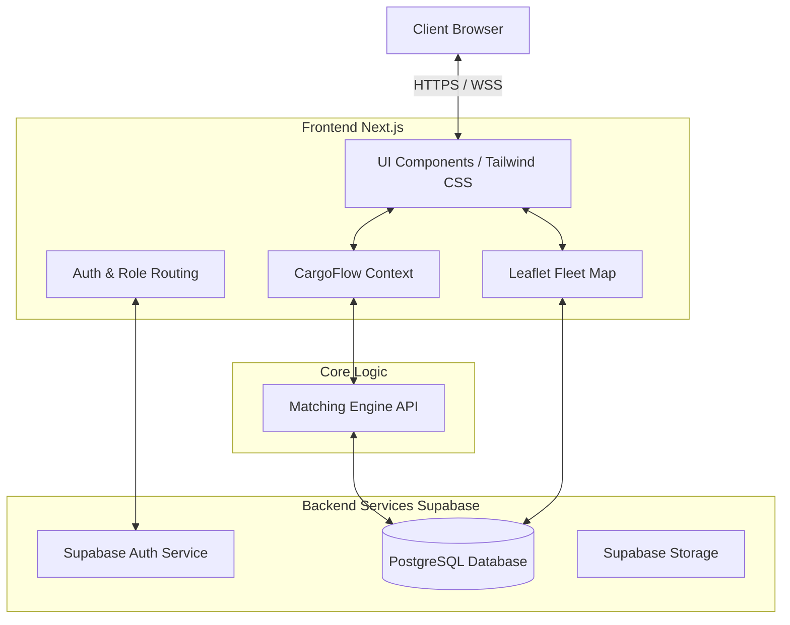
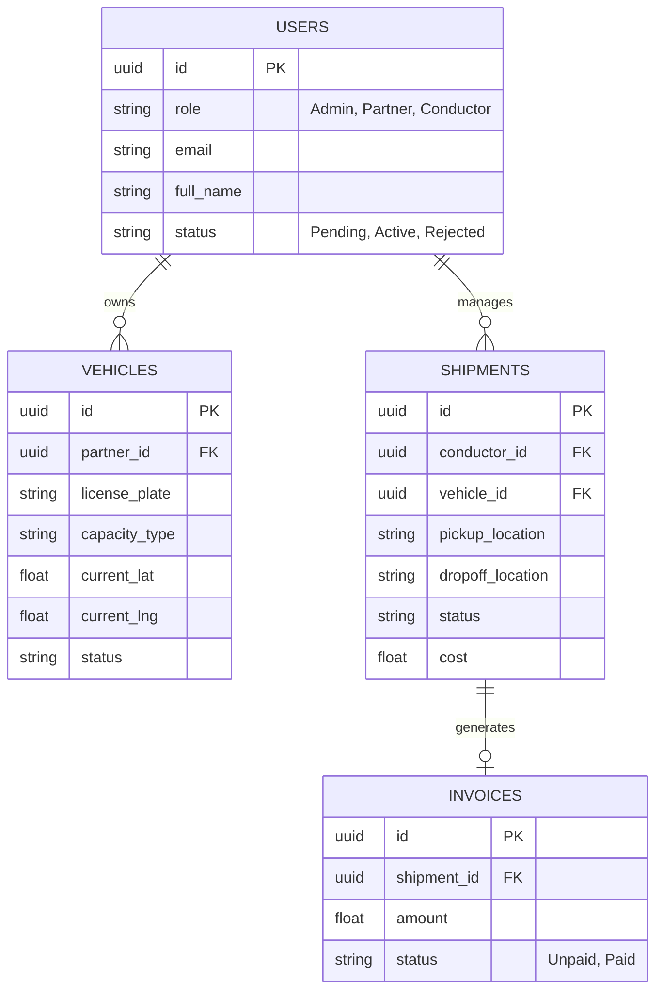
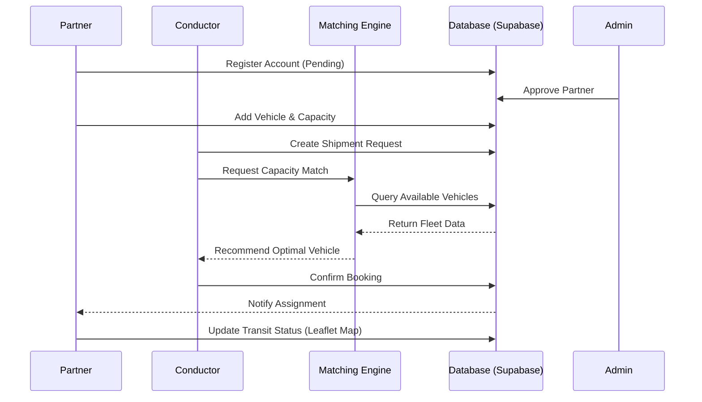

# ROUND 2 SUBMISSION GUIDELINES
## Project Documentation

---

## 1. Project Overview

### Project Name
**CargoFlow**

### Problem Statement
The logistics and freight industry suffers from significant operational inefficiencies, primarily due to fragmented communication, underutilized fleet capacity (empty miles), and a lack of real-time visibility across supply chain stakeholders. Conductors struggle to find available fleet capacity reliably, while transport partners face idle time and reduced profitability due to poorly optimized routing and load matching. 

### Proposed Solution
CargoFlow is a unified, real-time logistics and fleet management platform designed to bridge the gap between transport partners (fleet owners) and conductors (freight dispatchers). By providing a centralized marketplace with an intelligent matching engine, role-based dashboards, and real-time geospatial tracking, CargoFlow optimizes capacity utilization, automates invoice management, and provides end-to-end operational visibility.

### Brief Technical Overview
The system is a modern, responsive web application built on the Next.js 15 App Router framework using TypeScript. It utilizes a Supabase backend for robust PostgreSQL data management, secure role-based access control (RBAC), and authentication. Real-time fleet tracking is achieved using Leaflet for interactive map visualizations, while application state is efficiently managed via React Context.

---

## 2. System Architecture & Technology Stack

### Architecture / Block Diagram

### Key Modules
1. **Authentication & RBAC:** Manages secure logins and routes users to specific dashboards (Admin, Partner, Conductor).
2. **Dashboard Views:** Role-specific interfaces for Admins (system oversight), Partners (fleet management), and Conductors (shipment booking).
3. **Matching Engine (`lib/matching-engine.ts`):** Algorithm responsible for pairing available fleet capacity with pending shipment requests based on geospatial and timeline parameters.
4. **Geospatial Tracking (`components/maps/leaflet-fleet-map.tsx`):** Real-time visualization of fleet locations and shipment transit routes.
5. **Invoice & Shipment Management:** Modules for tracking financial transactions and freight status states.

### Technology Stack
* **Frontend:** Next.js (App Router), React 18, TypeScript, Tailwind CSS, Framer Motion
* **Mapping & GIS:** Leaflet, React-Leaflet
* **Backend & Database:** Supabase (PostgreSQL), REST APIs
* **Authentication:** Supabase Auth (`lib/auth-service.ts`)
* **Icons & UI Assets:** Lucide React

### System Requirements
* **Client:** Modern Web Browser (Chrome, Firefox, Safari) with JavaScript enabled.
* **Server/Hosting:** Node.js 18.17+ environment (compatible with Vercel or Google Cloud Run).
* **Database:** PostgreSQL 14+ (hosted via Supabase).

---

## 3. System Design

### ER / Database Diagram

### User Roles & Access Control
* **Admin:** Full system oversight. Can approve/reject partner registrations, view global analytics, and manage platform parameters.
* **Partner:** Fleet owners. Can register vehicles, declare available capacity, and accept shipment assignments.
* **Conductor:** Dispatchers/Clients. Can create shipments, view available capacity, and track active freight.

### APIs / Interfaces
* **Supabase Client (`lib/supabase.ts`):** Primary interface for DML operations.
* **Auth Service (`lib/auth-service.ts`):** Handles user session, JWT validation, and RBAC enforcement.
* **Matching Engine (`lib/matching-engine.ts`):** Internal API module that processes location, capacity, and timing data to output optimal shipment-to-vehicle pairings.

---

## 4. Technical Workflow & Methodology

### End-to-End Workflow

### Core Logic / Algorithms
**The Matching Engine:** 
The core algorithm evaluates a multi-dimensional matrix to pair shipments with vehicles. It filters the database for:
1. **Geospatial Proximity:** Distance between the vehicle's current location and the shipment's pickup coordinate.
2. **Capacity Constraints:** Ensures the vehicle's payload capacity >= shipment requirements.
3. **Availability Windows:** Time-based matching to ensure the fleet asset is unassigned during the transit window.

---

## 5. Implementation

### Module-wise Implementation
1. **State Management:** Implemented via `components/context/cargoflow-context.tsx` to provide a globally accessible, strongly-typed React Context for user sessions, active role, and high-frequency UI updates.
2. **Landing & UI:** Modular landing page built with distinct technical components (`hero.tsx`, `logistics-section.tsx`, `revenue-model.tsx`) ensuring lazy-loading and optimal First Contentful Paint (FCP).
3. **Geospatial Maps:** `leaflet-fleet-map.tsx` dynamically mounts client-side (bypassing SSR issues with Next.js) to render interactive marker clusters based on Supabase coordinate data.

### Key Technical Components
* **Next.js App Router:** Utilized for nested layouts (`app/layout.tsx`) and role-based directory structures (`app/admin`, `app/partner`, `app/conductor`).
* **Database Schema:** Enforced via `docs/schema.sql` and populated with `docs/seed.sql` for consistent development environments.

### Frameworks, Libraries, APIs
* **Next.js 15:** Core framework.
* **Tailwind CSS:** Utility-first styling methodology.
* **Supabase:** PostgreSQL DBaaS, GoTrue Auth.
* **Leaflet:** Open-source JavaScript library for mobile-friendly interactive maps.

---

## 6. Testing & Validation

### Testing Approach
* **Unit Testing:** Validating isolated pure functions, specifically the heuristics within `lib/matching-engine.ts`.
* **Integration Testing:** Ensuring the Supabase client correctly fetches and mutates data across the Partner and Conductor workflows.
* **Manual UI/UX Testing:** Validating responsive behavior using Chrome DevTools (simulating mobile viewports via `hooks/use-mobile.ts`).

### Test Cases (Key Examples)
1. *Auth Boundary:* Attempting to access `/app/admin/dashboard` with a Partner JWT must result in a 403/Redirect.
2. *Matching Logic:* Submitting a shipment requiring 10-ton capacity should filter out all 5-ton vehicles regardless of geospatial proximity.
3. *Map Rendering:* Fleet coordinates updating in the DB must reflect asynchronously on the Conductor's map view without full page reloads.

### Validation Method
Continuous local verification of the PostgreSQL schema against `docs/schema.sql`, combined with peer review of the matching engine's output accuracy utilizing mock data structures (`lib/mock-data.ts`).

### Prototype Screenshots
*(Note: For the final PDF submission, replace these placeholders with actual UI screenshots)*
* `[Screenshot 1: Landing Page - Hero & Map]`
* `[Screenshot 2: Admin Dashboard - Partner Approvals]`
* `[Screenshot 3: Conductor View - Live Fleet Tracking via Leaflet]`

---

## 7. Results, Limitations & Future Scope

### Results / Outputs
The current prototype successfully demonstrates a fully functional role-based marketplace. Partners can register and be triaged by Admins. Conductors can successfully view simulated fleet maps, create shipments, and view analytical mockups of their logistical operations.

### Technical Limitations
1. **Real-time GPS Streaming:** Currently relies on discrete polling or manual updates rather than continuous, high-frequency WebSocket hardware telematics ingestion.
2. **Algorithmic Complexity:** The matching engine operates efficiently on standard datasets but currently lacks machine learning enhancements (e.g., traffic predictions, weather routing).

### Future Technical Improvements
* **IoT Telematics Integration:** Direct API ingestion from ELD (Electronic Logging Devices) for live truck GPS coordinates.
* **AI-Driven Predictive Matching:** Utilizing historical data to predict capacity shortages in specific regions before they occur.
* **Mobile-Native Apps:** Porting the Conductor and Partner dashboards to React Native for on-the-go operational management and native push notifications.

---

## 8. References

1. **Next.js Documentation:** Official Vercel Next.js App Router API Reference. (https://nextjs.org/docs)
2. **Supabase Documentation:** PostgreSQL schema design, GoTrue Authentication. (https://supabase.com/docs)
3. **Leaflet JS:** Geospatial rendering logic and tile management. (https://leafletjs.com/reference.html)
4. **Tailwind CSS:** Utility styling architecture. (https://tailwindcss.com/docs)
